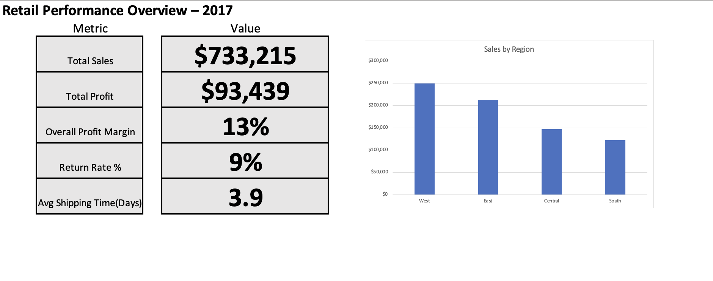
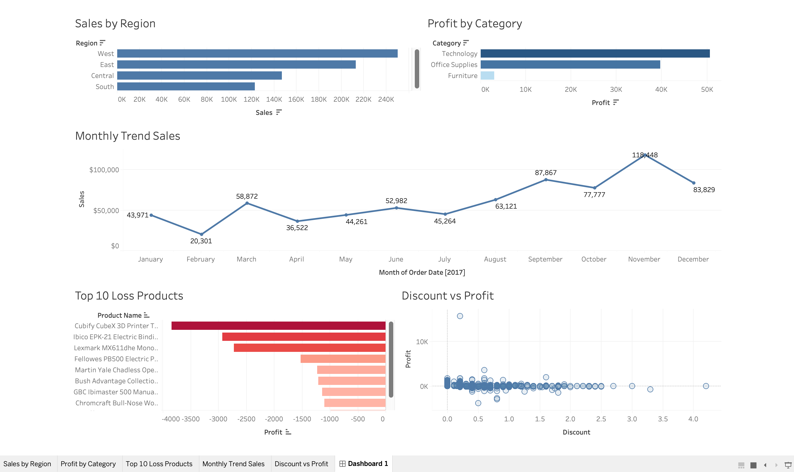

# Retail Performance Analysis – 2017

## 📊 Project Overview
This project analyzes retail sales performance using Python, Excel, and Tableau.  
The objective is to identify profitability trends, regional performance, product-level losses, and the impact of discounts on profit.

---

## 🛠 Tools Used
- Python (Pandas, Matplotlib, Seaborn)
- Microsoft Excel (Lookup Functions, Pivot Tables, KPI Dashboard)
- Tableau (Interactive BI Dashboard)

---

## 📂 Dataset
Superstore retail dataset containing:
- Orders
- Returns
- Managers
- Sales, Profit, Discount, Shipping Details

---

## 🔎 Key Analysis Performed

### 🐍 Python
- Data cleaning & preprocessing
- Feature engineering (Profit Margin, Shipping Days)
- Merging relational tables
- Exploratory Data Analysis

### 📊 Excel
- XLOOKUP & INDEX-MATCH practice
- Pivot table analysis
- KPI Dashboard creation
- Business metric calculations

### 📈 Tableau
- Sales by Region
- Profit by Category
- Monthly Sales Trend
- Top 10 Loss-Making Products
- Discount vs Profit Analysis
- Interactive region filtering

---

## 📌 Key Business Insights
- West region generates highest revenue.
- Furniture category shows lower profitability.
- Sales peak during Q4, especially November.
- Higher discounts significantly reduce profitability.
- Certain products consistently generate losses.

---

## 📷 Dashboard Preview

### Excel Dashboard

### Tableau Dashboard

---

## 🚀 Project Outcome
This project demonstrates end-to-end data analysis skills including:
- Data cleaning
- Business analysis
- Dashboard design
- Interactive visualization
- Analytical storytelling
